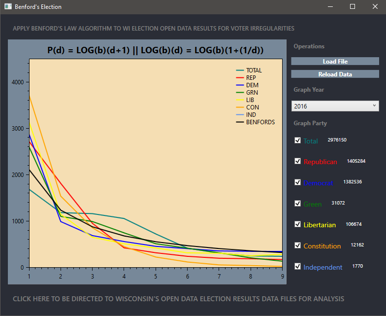
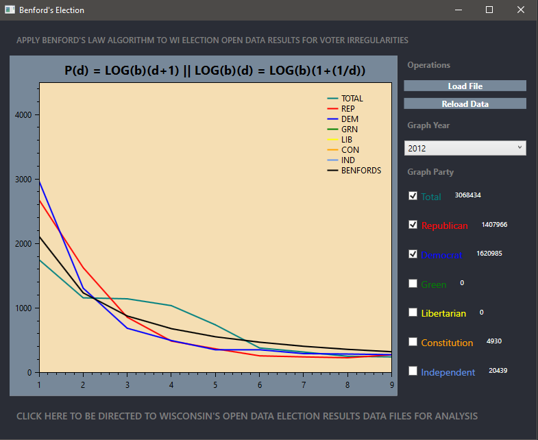

# BENFORDS_ELECTION
Applying Benford's Law To Wisconsin Open Elections Data

# tldr 
[Release 1.0 Download](https://github.com/michaelrinderle/BENFORDS_ELECTION/releases/download/R1.0/Benfords.Election.1.0.zip)

# program notes

This application takes open records data from the LTSB Open Data page to retrieve election
data from every precinct in Wisconsin for the general elections. If you are not aware of 
[Benford's Law](https://en.wikipedia.org/wiki/Benford%27s_law), it is an algorithm that is 
used to determine anonomalies in number distribution. This program will apply the algorithm
to all precinct total votes, as well as each party candidate vote by extracting the leading
digital of these vote tallies and placing them in an integer array that mimics the 1-9 value
distribution. Depending on the total of precincts, it will determine the appropriate scale
of the Benford curve to relate to each party's distribution for easily spotting anomolies.

If you have downloaded the app and need data. Go to WI OPEN DATA ---> [HERE](https://data-ltsb.opendata.arcgis.com/datasets/2012-2018-election-data-with-2020-wards)

# features

* .NET Core WPF Application 
	* Apply Benford's Law to 2012, 2016, & 2020 WI Presidential Elections
	* Select one or multiple parties to analyze voting distributions.
  * OxyPlot Graphs

